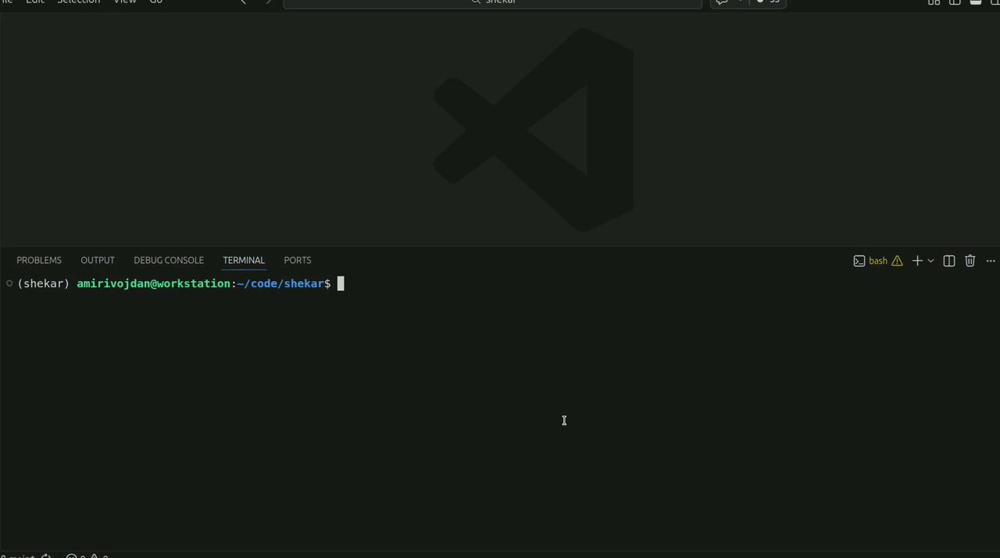

<p align="center">
<a href="https://pypi.python.org/pypi/shekar" target="_blank"></a>
<a href="https://pypi.python.org/pypi/shekar" target="_blank"></a>
<a href="https://pypi.python.org/pypi/shekar" target="_blank"></a>
<a href="https://pypi.python.org/pypi/shekar" target="_blank"></a>
<a href="https://pypi.python.org/pypi/shekar" target="_blank"></a>
<a href="https://doi.org/10.21105/joss.09128" target="_blank">
</a>
</p>

<p align="center">
    <em>Simplifying Persian NLP for Modern Applications</em>
</p>

**Shekar** is an open-source Python library for Persian natural language processing, inspired by the satirical story *[فارسی شکر است (Persian is Sugar)](https://fa.wikipedia.org/wiki/%D9%81%D8%A7%D8%B1%D8%B3%DB%8C_%D8%B4%DA%A9%D8%B1_%D8%A7%D8%B3%D8%AA)* by Mohammad Ali Jamalzadeh. Reflecting its emphasis on clear and accessible language, Shekar provides fast, modular tools for Persian text processing, including normalization, tokenization, POS tagging, NER, embeddings, and spell checking, enabling reproducible workflows for both research and production.

## Why Shekar?

- **Advanced text normalization**: Built for the complexity of Persian text.
- **Blazing fast and production-ready**: Optimized for large-scale processing and real-time use.
- **Modular and highly customizable**: Independent, composable components for flexible NLP pipelines.
- **Lightweight and efficient**: Minimal dependencies and small models for fast CPU inference.  
- **Reliable and well-tested**: Backed by **hundreds of test cases** with **95%+ code coverage**.

## Installation

You can install Shekar with pip. By default, the `CPU` runtime of ONNX is included, which works on all platforms.

### CPU Installation (All Platforms)

<!-- termynal -->
```bash
$ pip install shekar
```
This works on **Windows**, **Linux**, and **macOS** (including Apple Silicon M1/M2/M3).

### GPU Acceleration (NVIDIA CUDA)

<!-- termynal -->
```bash
$ pip install shekar && pip uninstall -y onnxruntime && pip install onnxruntime-gpu
```

## Web Interface

Shekar includes a built-in web interface for interactively exploring its NLP capabilities (no coding required). Launch it with a single command:

<!-- termynal -->
```bash
$ shekar serve -p 8080
```



## Preprocessing

[](examples/preprocessing.ipynb)  [](https://colab.research.google.com/github/amirivojdan/shekar/blob/main/examples/preprocessing.ipynb)

### Normalizer

The built-in `Normalizer` class provides a ready-to-use, opinionated normalization pipeline for Persian text. It combines the most common and error-prone normalization steps into a single component, covering the majority of real-world use cases such as web text, social media, OCR output, and mixed informal–formal writing.

Most importantly, the normalization rules in Shekar strictly follow the official guidelines of **[Academy of Persian Language and Literature](https://apll.ir/)** (فرهنگستان زبان و ادب فارسی). This makes the output suitable not only for NLP pipelines, but also for linguistically correct and publishable Persian text.

```python
from shekar import Normalizer

normalizer = Normalizer()

text = "«فارسی شِکَر است» نام داستان ڪوتاه طنز    آمێزی از محمد علی جمالــــــــزاده ی گرامی می   باشد که در سال 1921 منتشر  شده است و آغاز   ڱر تحول بزرگی در ادَبێات معاصر ایران بۃ شمار میرود."
print(normalizer(text))

# نرمال‌سازی نویسه‌های گفتاری و روزمره
text = normalizer("می دونی که نمیخاستم ناراحتت کنم.اما خونه هاشون خیلی گرون تر شده")
print(text)

# نرمال‌سازی واژه‌های مرکب و افعال پیشوندی! 
text = normalizer("یک کار آفرین نمونه و سخت کوش ، پیروز مندانه از پس دشواری ها برخواهدآمد.")
print(text) 

```

```shell
«فارسی شکر است» نام داستان کوتاه طنزآمیزی از محمد‌علی جمالزاده‌ی گرامی می‌باشد که در سال ۱۹۲۱ منتشر شده‌است و آغازگر تحول بزرگی در ادبیات معاصر ایران به شمار می‌رود.

می‌دونی که نمی‌خاستم ناراحتت کنم. اما خونه‌هاشون خیلی گرون‌تر شده

یک کارآفرین نمونه و سخت‌کوش، پیروزمندانه از پس دشواری‌ها بر خواهد آمد.
```

### Customization

Shekar is built around a modular and composable preprocessing framework that allows fine-grained control over each step of text processing. Preprocessing is implemented as small, independent operators such as `filters`, `normalizers`, and `maskers`, which can be used on their own or combined into flexible pipelines.

Pipelines are constructed using the Pipeline abstraction and composed with the `|` operator, making preprocessing logic explicit, readable, and easy to customize. Any operator from the [full list of preprocessing components](https://lib.shekar.io/tutorials/preprocessing/)
 can be freely combined.

For example, the following pipeline is functionally equivalent to the default normalizer:

```python
from shekar.preprocessing import (
    PunctuationNormalizer,
    AlphabetNormalizer,
    DigitNormalizer,
    SpacingNormalizer,
    RemoveDiacritics,
    RepeatedLetterNormalizer,
    ArabicUnicodeNormalizer,
    YaNormalizer,
)

normalizer = (
            AlphabetNormalizer()
            | ArabicUnicodeNormalizer()
            | DigitNormalizer()
            | PunctuationNormalizer()
            | RemoveDiacritics()
            | RepeatedLetterNormalizer()
            | SpacingNormalizer()
            | YaNormalizer(style="joda")
        )
```

Operators can also be composed for lightweight, task-specific preprocessing. For example, removing emojis and punctuation:

```python
from shekar.preprocessing import EmojiRemover, PunctuationRemover

text = "ز ایران دلش یاد کرد و بسوخت! 🌍🇮🇷"
pipeline = EmojiRemover() | PunctuationRemover()
output = pipeline(text)
print(output)
```

```shell
ز ایران دلش یاد کرد و بسوخت
```

## Tokenization

### WordTokenizer
The WordTokenizer class in Shekar is a simple, rule-based tokenizer for Persian that splits text based on punctuation and whitespace using Unicode-aware regular expressions.

```python
from shekar import WordTokenizer

tokenizer = WordTokenizer()

text = "چه سیب‌های قشنگی! حیات نشئهٔ تنهایی است."
tokens = list(tokenizer(text))
print(tokens)
```

```shell
["چه", "سیب‌های", "قشنگی", "!", "حیات", "نشئهٔ", "تنهایی", "است", "."]
```

### SentenceTokenizer

The `SentenceTokenizer` class is designed to split a given text into individual sentences. This class is particularly useful in natural language processing tasks where understanding the structure and meaning of sentences is important. The `SentenceTokenizer` class can handle various punctuation marks and language-specific rules to accurately identify sentence boundaries.

Below is an example of how to use the `SentenceTokenizer`:

```python
from shekar.tokenization import SentenceTokenizer

text = "هدف ما کمک به یکدیگر است! ما می‌توانیم با هم کار کنیم."
tokenizer = SentenceTokenizer()
sentences = tokenizer(text)

for sentence in sentences:
    print(sentence)
```

```output
هدف ما کمک به یکدیگر است!
ما می‌توانیم با هم کار کنیم.
```

## Embeddings

[](examples/embeddings.ipynb)  [](https://colab.research.google.com/github/amirivojdan/shekar/blob/main/examples/embeddings.ipynb)

**Shekar** offers two main embedding classes:

- **`WordEmbedder`**: Provides static word embeddings using pre-trained FastText models.
- **`ContextualEmbedder`**: Provides contextual embeddings using a fine-tuned ALBERT model.

Both classes share a consistent interface:

- `embed(text)` returns a NumPy vector.
- `transform(text)` is an alias for `embed(text)` to integrate with pipelines.

### Word Embeddings

`WordEmbedder` supports two static FastText models:

- **`fasttext-d100`**: A 100-dimensional CBOW model trained on [Persian Wikipedia](https://huggingface.co/datasets/codersan/Persian-Wikipedia-Corpus).
- **`fasttext-d300`**: A 300-dimensional CBOW model trained on the large-scale [Naab dataset](https://huggingface.co/datasets/SLPL/naab).


```python
from shekar.embeddings import WordEmbedder

embedder = WordEmbedder(model="fasttext-d100")

embedding = embedder("کتاب")
print(embedding.shape)

similar_words = embedder.most_similar("کتاب", top_n=5)
print(similar_words)
```

### Contextual Embeddings

`ContextualEmbedder` uses an ALBERT model trained with Masked Language Modeling (MLM) on the Naab dataset to generate high-quality contextual embeddings.
The resulting embeddings are 768-dimensional vectors representing the semantic meaning of entire phrases or sentences.

```python
from shekar.embeddings import ContextualEmbedder

embedder = ContextualEmbedder(model="albert")

sentence = "کتاب‌ها دریچه‌ای به جهان دانش هستند."
embedding = embedder(sentence)
print(embedding.shape)  # (768,)
```

## Stemming

The `Stemmer` is a lightweight, rule-based reducer for Persian word forms. It trims common suffixes while respecting Persian orthography and Zero Width Non-Joiner usage. The goal is to produce stable stems for search, indexing, and simple text analysis without requiring a full morphological analyzer.

```python
from shekar import Stemmer

stemmer = Stemmer()

print(stemmer("نوه‌ام"))
print(stemmer("کتاب‌ها"))
print(stemmer("خانه‌هایی"))
print(stemmer("خونه‌هامون"))
```

```output
نوه
کتاب
خانه
خانه
```

## Lemmatization

The `Lemmatizer` maps Persian words to their base dictionary form. Unlike stemming, which only trims affixes, lemmatization uses explicit verb conjugation rules, vocabulary lookups, and a stemmer fallback to ensure valid lemmas. This makes it more accurate for tasks like part-of-speech tagging, text normalization, and linguistic analysis where the canonical form of a word is required.

```python
from shekar import Lemmatizer

lemmatizer = Lemmatizer()

# ریشه‌یابی افعال
print(lemmatizer("رفتند"))
print(lemmatizer("گفته بوده‌ایم"))

# ریشه‌یابی واژه‌ها
print(lemmatizer("کتاب‌ها"))
print(lemmatizer("خانه‌هایی"))
print(lemmatizer("خونه‌هامون"))

# ریشه‌یابی افعال پیشوندی
print(lemmatizer("بر نخواهم گشت"))
print(lemmatizer("برنمی‌دارم"))
```

```output
رفت/رو
گفت/گو
کتاب
خانه
خانه
برگشت/برگرد
برداشت/بردار
```

## Part-of-Speech Tagging

[](examples/pos_tagging.ipynb)  [](https://colab.research.google.com/github/amirivojdan/shekar/blob/main/examples/pos_tagging.ipynb)

The POSTagger class provides part-of-speech tagging for Persian text using a transformer-based model (default: ALBERT). It returns one tag per word based on Universal POS tags (following the Universal Dependencies standard).

Example usage:

```python
from shekar import POSTagger

pos_tagger = POSTagger()
text = "نوروز، جشن سال نو ایرانی، بیش از سه هزار سال قدمت دارد و در کشورهای مختلف جشن گرفته می‌شود."

result = pos_tagger(text)
for word, tag in result:
    print(f"{word}: {tag}")
```

```output
نوروز: PROPN
،: PUNCT
جشن: NOUN
سال: NOUN
نو: ADJ
ایرانی: ADJ
،: PUNCT
بیش: ADJ
از: ADP
سه: NUM
هزار: NUM
سال: NOUN
قدمت: NOUN
دارد: VERB
و: CCONJ
در: ADP
کشورهای: NOUN
مختلف: ADJ
جشن: NOUN
گرفته: VERB
می‌شود: VERB
.: PUNCT
```

## Named Entity Recognition (NER)

[](examples/ner.ipynb)  [](https://colab.research.google.com/github/amirivojdan/shekar/blob/main/examples/ner.ipynb)

The `NER` module offers a fast, quantized Named Entity Recognition pipeline using a fine-tuned ALBERT model. It detects common Persian entities such as persons, locations, organizations, and dates. This model is designed for efficient inference and can be easily combined with other preprocessing steps.

Example usage:

```python
from shekar import NER
from shekar import Normalizer

input_text = (
    "شاهرخ مسکوب به سالِ ۱۳۰۴ در بابل زاده شد و دوره ابتدایی را در تهران و در مدرسه علمیه پشت "
    "مسجد سپهسالار گذراند. از کلاس پنجم ابتدایی مطالعه رمان و آثار ادبی را شروع کرد. از همان زمان "
    "در دبیرستان ادب اصفهان ادامه تحصیل داد. پس از پایان تحصیلات دبیرستان در سال ۱۳۲۴ از اصفهان به تهران رفت و "
    "در رشته حقوق دانشگاه تهران مشغول به تحصیل شد."
)

normalizer = Normalizer()
normalized_text = normalizer(input_text)

albert_ner = NER()
entities = albert_ner(normalized_text)

for text, label in entities:
    print(f"{text} → {label}")
```

```output
شاهرخ مسکوب → PER
سال ۱۳۰۴ → DAT
بابل → LOC
دوره ابتدایی → DAT
تهران → LOC
مدرسه علمیه → LOC
مسجد سپهسالار → LOC
دبیرستان ادب اصفهان → LOC
در سال ۱۳۲۴ → DAT
اصفهان → LOC
تهران → LOC
دانشگاه تهران → ORG
فرانسه → LOC
```

## Dependency Parsing

The `DependencyParser` class provides syntactic dependency parsing for Persian text using a transformer-based model (default: ALBERT). It analyzes the grammatical structure of a sentence and returns, for each word, its syntactic head (1-indexed, where 0 means ROOT) and the dependency relation label following the Universal Dependencies standard.

The `print_tree()` method renders the parse result as a readable tree structure.

```python
from shekar import DependencyParser

parser = DependencyParser()
text = "ما با آنچه می‌سازیم ایرانی هستیم."

result = parser(text)
for word, head, deprel in result:
    print(f"{word} ← (head: {head}, relation: {deprel})")
```

```output
ما ← (head: 6, relation: nsubj)
با ← (head: 3, relation: case)
آنچه ← (head: 6, relation: obl)
می‌سازیم ← (head: 3, relation: acl)
ایرانی ← (head: 6, relation: xcomp)
هستیم ← (head: 0, relation: root)
. ← (head: 6, relation: punct)
```

You can also visualize the parse tree using `print_tree()`:

```python
parser.print_tree(result)
```

```output
ROOT
└── [root] هستیم
    ├── [nsubj] ما
    ├── [obl] آنچه
    │   ├── [case] با
    │   └── [acl] می‌سازیم
    ├── [xcomp] ایرانی
    └── [punct] .
```

## Classification

The `classification` module provides high-level text classification utilities for Persian, covering both sentiment analysis and offensive language detection through a unified and consistent interface. Each classifier returns a predicted label along with a confidence score.

### Sentiment Analysis

The `SentimentClassifier` module enables automatic sentiment analysis of Persian text using transformer-based models. It currently supports the `AlbertBinarySentimentClassifier`, a lightweight ALBERT model fine-tuned on Snapfood dataset to classify text as **positive** or **negative**, returning both the predicted label and its confidence score.

**Example usage:**

```python
from shekar.classification import SentimentClassifier

sentiment_classifier = SentimentClassifier()

print(sentiment_classifier("سریال قصه‌های مجید عالی بود!"))
print(sentiment_classifier("فیلم ۳۰۰ افتضاح بود!"))
```

```output
('positive', 0.9923112988471985)
('negative', 0.9330866932868958)
```

### Toxicity Detection

The `toxicity` module currently includes a Logistic Regression classifier trained on TF-IDF features extracted from the [Naseza (ناسزا) dataset](https://github.com/amirivojdan/naseza), a large-scale collection of Persian text labeled for offensive and neutral language. The `OffensiveLanguageClassifier` processes input text to determine whether it is neutral or offensive, returning both the predicted label and its confidence score.

```python
from shekar.classification import OffensiveLanguageClassifier

offensive_classifier = OffensiveLanguageClassifier()

print(offensive_classifier("زبان فارسی میهن من است!"))
print(offensive_classifier("تو خیلی احمق و بی‌شرفی!"))
```

```output
('neutral', 0.7651197910308838)
('offensive', 0.7607775330543518)
```

## Keyword Extraction

[](examples/keyword_extraction.ipynb)  [](https://colab.research.google.com/github/amirivojdan/shekar/blob/main/examples/keyword_extraction.ipynb)

The **shekar.keyword_extraction** module provides tools for automatically identifying and extracting key terms and phrases from Persian text. These algorithms help identify the most important concepts and topics within documents.

```python
from shekar import KeywordExtractor

extractor = KeywordExtractor(max_length=2, top_n=10)

input_text = (
    "زبان فارسی یکی از زبان‌های مهم منطقه و جهان است که تاریخچه‌ای کهن دارد. "
    "زبان فارسی با داشتن ادبیاتی غنی و شاعرانی برجسته، نقشی بی‌بدیل در گسترش فرهنگ ایرانی ایفا کرده است. "
    "از دوران فردوسی و شاهنامه تا دوران معاصر، زبان فارسی همواره ابزار بیان اندیشه، احساس و هنر بوده است. "
)

keywords = extractor(input_text)

for kw in keywords:
    print(kw)
```

```output
فرهنگ ایرانی
گسترش فرهنگ
ایرانی ایفا
زبان فارسی
تاریخچه‌ای کهن
```

## Spell Checking

The `SpellChecker` class provides simple and effective spelling correction for Persian text. It can automatically detect and fix common errors such as extra characters, spacing mistakes, or misspelled words. You can use it directly as a callable on a sentence to clean up the text, or call `suggest()` to get a ranked list of correction candidates for a single word.

```python
from shekar import SpellChecker

spell_checker = SpellChecker()
print(spell_checker("سسلام بر ششما ددوست من"))
print(spell_checker.suggest("درود"))
```

```output
سلام بر شما دوست من
['درود', 'درصد', 'ورود', 'درد', 'درون']
```

## WordCloud

[](examples/word_cloud.ipynb)  [](https://colab.research.google.com/github/amirivojdan/shekar/blob/main/examples/word_cloud.ipynb)

The `WordCloud` class provides a convenient interface for generating Persian word clouds with correct shaping, directionality, and typography. It is specifically designed to work with right-to-left Persian text and integrates seamlessly with Shekar’s normalization utilities to produce visually accurate and linguistically correct results.

The WordCloud functionality depends on visualization libraries that are not installed by default. To enable this feature, install Shekar with the optional visualization dependencies:

<!-- termynal -->
```bash
$ pip install 'shekar[viz]'
```
**Example usage:**

```python
import requests
from collections import Counter

from shekar.visualization import WordCloud
from shekar import WordTokenizer
from shekar.preprocessing import (
  HTMLTagRemover,
  PunctuationRemover,
  StopWordRemover,
  NonPersianRemover,
)
preprocessing_pipeline = HTMLTagRemover() | PunctuationRemover() | StopWordRemover() | NonPersianRemover()


url = f"https://shahnameh.me/p.php?id=F82F6CED"
response = requests.get(url)
html_content = response.text
clean_text = preprocessing_pipeline(html_content)

word_tokenizer = WordTokenizer()
tokens = word_tokenizer(clean_text)

word_freqs = Counter(tokens)

wordCloud = WordCloud(
        mask="Iran",
        width=640,
        height=480,
        max_font_size=220,
        min_font_size=6,
        bg_color="white",
        contour_color="black",
        contour_width=5,
        color_map="greens",
    )

# if shows disconnect words, try again with bidi_reshape=True
image = wordCloud.generate(word_freqs, bidi_reshape=False)
image.show()
```


## Download Models

If Shekar Hub is unavailable, you can manually download the models and place them in the cache directory at `home/[username]/.shekar/` 

| Model Name                | Download Link |
|----------------------------|---------------|
| FastText Embedding d100    | [Download](https://drive.google.com/file/d/1qgd0slGA3Ar7A2ShViA3v8UTM4qXIEN6/view?usp=drive_link) (50MB)|
| FastText Embedding d300    | [Download](https://drive.google.com/file/d/1yeAg5otGpgoeD-3-E_W9ZwLyTvNKTlCa/view?usp=drive_link) (500MB)|
| SentenceEmbedding    | [Download](https://drive.google.com/file/d/1PftSG2QD2M9qzhAltWk_S38eQLljPUiG/view?usp=drive_link) (60MB)|
| POS Tagger  | [Download](https://drive.google.com/file/d/1d80TJn7moO31nMXT4WEatAaTEUirx2Ju/view?usp=drive_link) (38MB)|
| NER       | [Download](https://drive.google.com/file/d/1DLoMJt8TWlNnGGbHDWjwNGsD7qzlLHfu/view?usp=drive_link) (38MB)|
| Dependency Parser  | [Download](https://drive.google.com/file/d/1Y2XjS04qpLSl7zq-349IJc5A7BRB3keC/view?usp=sharing) (36MB)|
| Sentiment Classifier       | [Download](https://drive.google.com/file/d/17gTip7RwipEkA7Rf3-Cv1W8XNHTdaS4c/view?usp=drive_link) (38MB)|
| Offensive Language Classifier       | [Download](https://drive.google.com/file/d/1ZLiFI6nzpQ2rYjJTKxOYKTfD9IqHZ5tc/view?usp=drive_link) (8MB)|
| AlbertTokenizer   | [Download](https://drive.google.com/file/d/1w-oe53F0nPePMcoor5FgXRwRMwkYqDqM/view?usp=drive_link) (2MB)|

-----

## Citation

If you find **Shekar** useful in your research, please consider citing the following paper:

```
@article{Amirivojdan_Shekar,
author = {Amirivojdan, Ahmad},
doi = {10.21105/joss.09128},
journal = {Journal of Open Source Software},
month = oct,
number = {114},
pages = {9128},
title = {{Shekar: A Python Toolkit for Persian Natural Language Processing}},
url = {https://joss.theoj.org/papers/10.21105/joss.09128},
volume = {10},
year = {2025}
}
```

<p align="center"><em>With ❤️ for <strong>IRAN</strong></em></p>
